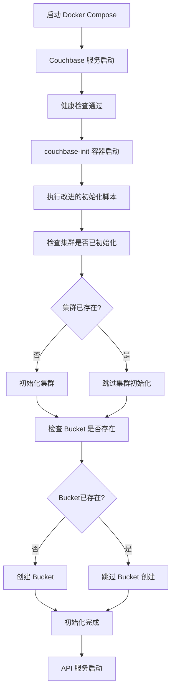

# Couchbase 自动化初始化系统

## 概述

Hilton 预订系统现在使用自动化的 Couchbase 初始化方案，无需手动执行初始化脚本。

## 架构

### 方案1：初始化容器 + 改进脚本

系统包含以下组件：

1. **couchbase** - 主 Couchbase 数据库服务
2. **couchbase-init** - 自动初始化容器（一次性）
3. **改进的初始化脚本** - 具有重试逻辑和幂等性检查

## 工作流程



## 主要特性

### 🔄 幂等性操作
- 脚本可以安全地多次运行
- 自动检测已存在的配置
- 避免重复初始化错误

### ⏰ 智能重试机制
- 等待 Couchbase 完全启动
- 60次重试，每次间隔2秒
- 优雅的错误处理

### 📊 详细日志输出
- 实时显示初始化进度
- 彩色 emoji 状态指示
- 清晰的错误信息

### 🔧 依赖管理
- API 服务等待初始化完成
- 使用 Docker Compose 健康检查
- 正确的服务启动顺序

## 文件结构

```
infrastructure/database/
├── init-couchbase.sh              # 原始手动脚本
└── init-couchbase-improved.sh     # 新的自动化脚本

docker-compose.yml                  # 包含 couchbase-init 服务
start-services.sh                   # 自动启动脚本（可选）
```

## 使用方法

### 方法一：使用 Docker Compose（推荐）

```bash
# 启动所有服务
docker-compose up -d

# 查看初始化过程
docker logs -f hilton-couchbase-init

# 检查服务状态
docker-compose ps
```

### 方法二：使用自动启动脚本

```bash
# 执行自动启动脚本
./start-services.sh
```

## 环境变量

couchbase-init 服务支持以下环境变量：

| 变量名 | 默认值 | 说明 |
|--------|--------|------|
| `COUCHBASE_HOST` | `couchbase:8091` | Couchbase 服务地址 |
| `COUCHBASE_USERNAME` | `Administrator` | 管理员用户名 |
| `COUCHBASE_PASSWORD` | `password` | 管理员密码 |
| `BUCKET_NAME` | `hilton_reservations` | 要创建的 Bucket 名称 |

## 故障排除

### 初始化超时
```bash
# 检查 Couchbase 日志
docker logs hilton-couchbase

# 检查初始化日志
docker logs hilton-couchbase-init
```

### 服务无法启动
```bash
# 重置所有服务
docker-compose down
docker-compose up -d
```

### 手动初始化（备用方案）
```bash
# 如果自动初始化失败，可以手动运行
docker exec -it hilton-couchbase /opt/couchbase/init-couchbase.sh
```

## 验证初始化

### 检查集群状态
```bash
curl -u Administrator:password "http://localhost:8091/pools/default"
```

### 检查 Bucket
```bash
curl -u Administrator:password "http://localhost:8091/pools/default/buckets/hilton_reservations"
```

### 测试 GraphQL API
```bash
curl -X POST http://localhost:4000/graphql \
  -H "Content-Type: application/json" \
  -d '{"query":"{ getReservationsByEmail(email: \"459718122@qq.com\") { id guestName status } }"}'
```

## 相关组件

- **Couchbase Community 7.1.1** - 数据库服务
- **Docker Compose** - 容器编排
- **健康检查** - 服务就绪检测
- **依赖管理** - 确保正确的启动顺序

## 下次启动

重新启动系统时：
1. 如果数据卷保持不变，初始化脚本会检测到现有配置并跳过初始化
2. 如果清除了数据卷，将自动重新初始化
3. 无需手动干预

## 日志示例

成功的初始化日志示例：
```
🚀 开始 Couchbase 自动化初始化...
⏳ 尝试连接 Couchbase (1/60)...
✅ Couchbase 服务已就绪
✅ Couchbase 集群已经初始化
⏳ 等待集群完全就绪...
✅ Bucket 'hilton_reservations' 已存在
⏳ 等待 bucket 完全就绪...
🎉 Couchbase 自动化初始化完成！
``` 