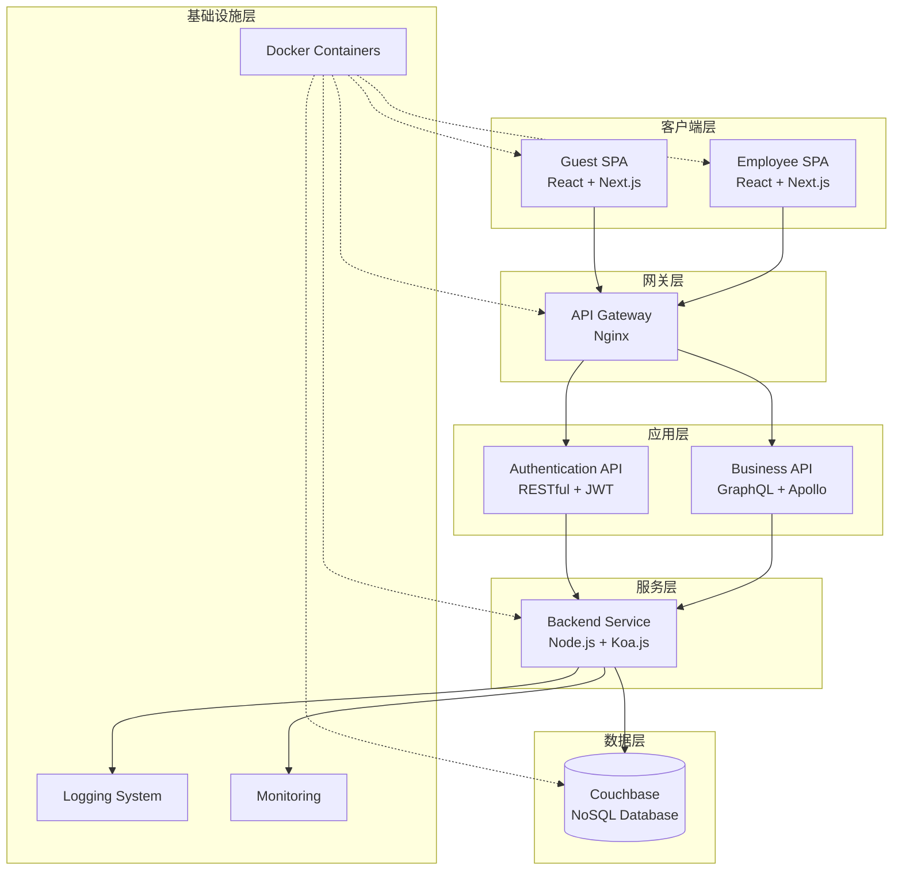
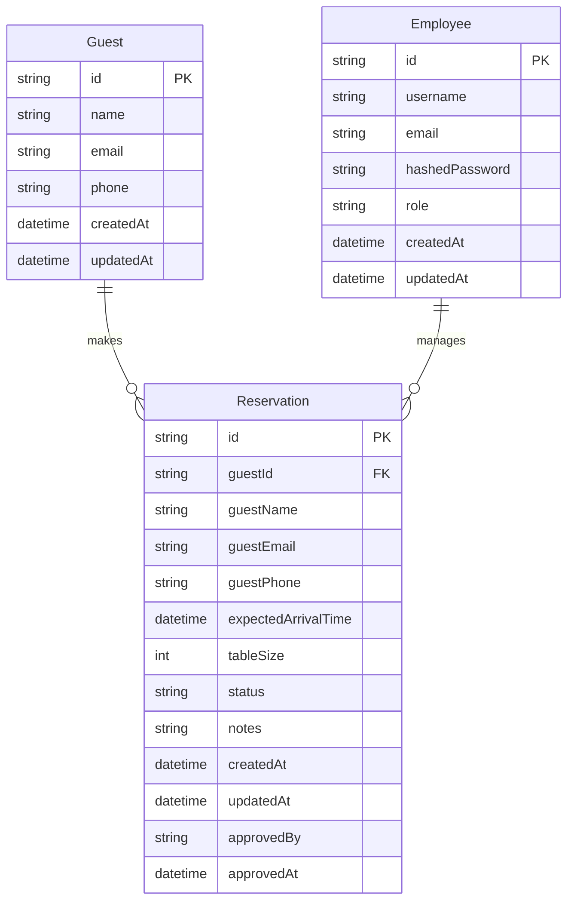
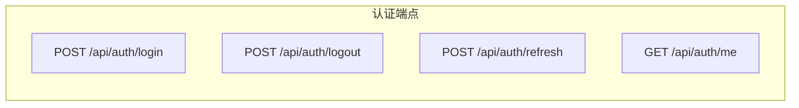
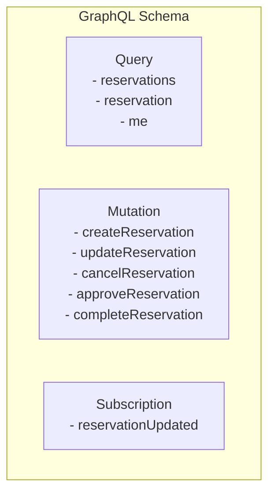
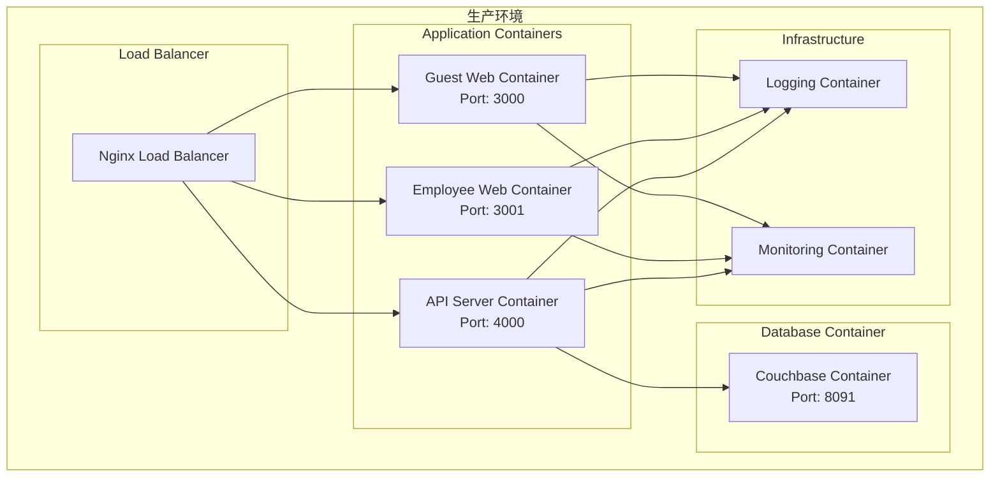
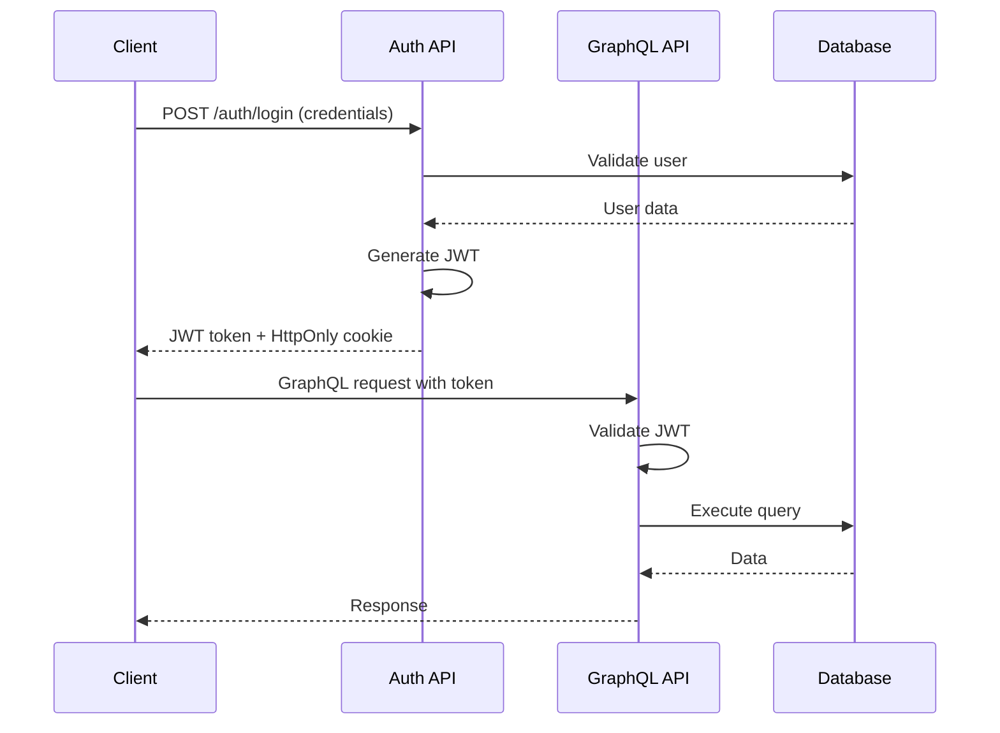
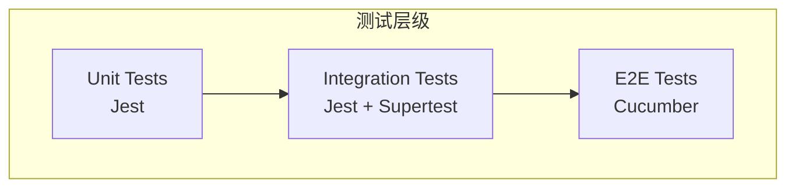
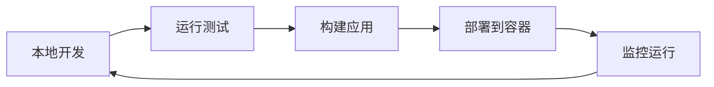

# 希尔顿餐桌预定系统 - 系统架构文档

## 1. 系统概述

希尔顿餐桌预定系统是一个为餐厅提供在线预定服务的全栈应用，支持客人预定餐桌和餐厅员工管理预定。

### 1.1 核心功能
- **客人端功能**：预定餐桌、更新预定、取消预定
- **员工端功能**：查看预定、管理预定状态、按条件筛选预定、联系客人

### 1.2 用户角色
- **Guest（客人）**：可以创建、查看、更新和取消自己的预定
- **Employee（员工）**：可以管理所有预定，更新预定状态

### 1.3 预定状态流转
```
Requested → Approved → Completed
    ↓         ↓         
Cancelled ← Cancelled
```

## 2. 技术架构

### 2.1 整体架构图



### 2.2 技术栈

#### 前端技术栈
- **框架**: React.js 18+ with TypeScript
- **路由**: Next.js 14+ (App Router)
- **UI组件**: Shadcn UI + TailwindCSS
- **状态管理**: Apollo Client (缓存和状态)
- **数据获取**: Apollo Client (GraphQL)
- **认证**: JWT Token with HTTP-only cookies

#### 后端技术栈
- **运行时**: Node.js 18+ with TypeScript
- **Web框架**: Koa.js
- **GraphQL**: Apollo Server
- **认证**: JSON Web Tokens (JWT)
- **数据库**: Couchbase 7+
- **测试**: Cucumber + Jest
- **文档**: GraphQL Playground

#### 基础设施
- **容器化**: Docker & Docker Compose
- **代理**: Nginx
- **日志**: Winston
- **监控**: 健康检查端点

## 3. 数据模型设计

### 3.1 数据实体关系图



### 3.2 状态枚举
```typescript
enum ReservationStatus {
  REQUESTED = 'Requested',
  APPROVED = 'Approved', 
  CANCELLED = 'Cancelled',
  COMPLETED = 'Completed'
}

enum UserRole {
  GUEST = 'guest',
  EMPLOYEE = 'employee'
}
```

## 4. API设计

### 4.1 RESTful认证API



#### 端点规范
- `POST /api/auth/login` - 用户登录
- `POST /api/auth/logout` - 用户登出  
- `POST /api/auth/refresh` - 刷新token
- `GET /api/auth/me` - 获取当前用户信息

### 4.2 GraphQL业务API



#### 主要操作
**查询操作**:
- `reservations(filter, pagination)` - 获取预定列表
- `reservation(id)` - 获取单个预定详情
- `me` - 获取当前用户信息

**变更操作**:
- `createReservation(input)` - 创建预定
- `updateReservation(id, input)` - 更新预定
- `cancelReservation(id)` - 取消预定
- `approveReservation(id)` - 批准预定（员工）
- `completeReservation(id)` - 完成预定（员工）

**订阅操作**:
- `reservationUpdated` - 预定状态实时更新

## 5. 项目结构

### 5.1 Mono-Repo结构

```
hilton-reservation/
├── apps/
│   ├── guest-web/                 # 客人端SPA
│   ├── employee-web/              # 员工端SPA  
│   └── api-server/                # 后端API服务
├── packages/
│   ├── shared-types/              # 共享TypeScript类型
│   ├── ui-components/             # 共享UI组件
│   └── utils/                     # 共享工具函数
├── infrastructure/
│   ├── docker/                    # Docker配置
│   ├── nginx/                     # Nginx配置
│   └── database/                  # 数据库脚本
├── docs/                          # 文档
├── tests/                         # E2E测试
├── package.json                   # 根package.json
├── docker-compose.yml             # 容器编排
├── .gitignore
└── README.md
```

### 5.2 后端服务结构

```
apps/api-server/
├── src/
│   ├── controllers/               # 控制器层
│   ├── services/                  # 业务逻辑层
│   ├── repositories/              # 数据访问层
│   ├── graphql/                   # GraphQL Schema和Resolvers
│   ├── middleware/                # 中间件
│   ├── utils/                     # 工具函数
│   ├── types/                     # TypeScript类型定义
│   └── app.ts                     # 应用入口
├── tests/                         # 单元测试和集成测试
├── features/                      # Cucumber特性文件
├── Dockerfile
└── package.json
```

### 5.3 前端应用结构

```
apps/guest-web/ | apps/employee-web/
├── src/
│   ├── app/                       # Next.js App Router
│   ├── components/                # React组件
│   ├── lib/                       # 工具库和Apollo配置
│   ├── hooks/                     # 自定义Hooks
│   ├── types/                     # TypeScript类型
│   └── styles/                    # 样式文件
├── public/                        # 静态资源
├── next.config.js                 # Next.js配置
├── tailwind.config.js             # TailwindCSS配置
├── Dockerfile
└── package.json
```

## 6. 部署架构

### 6.1 容器架构图



### 6.2 Docker编排配置

```yaml
# docker-compose.yml 概览
services:
  guest-web:
    build: ./apps/guest-web
    ports: ["3000:3000"]
    
  employee-web:
    build: ./apps/employee-web  
    ports: ["3001:3000"]
    
  api-server:
    build: ./apps/api-server
    ports: ["4000:4000"]
    environment:
      - DATABASE_URL=couchbase://database:8091
      
  database:
    image: couchbase:community-7.1.1
    ports: ["8091:8091"]
    volumes: ["couchbase-data:/opt/couchbase/var"]
    
  nginx:
    build: ./infrastructure/nginx
    ports: ["80:80", "443:443"]
    depends_on: [guest-web, employee-web, api-server]
```

## 7. 安全架构

### 7.1 认证流程



### 7.2 授权策略

- **基于角色的访问控制(RBAC)**
- **JWT Token认证**
- **GraphQL字段级权限控制**
- **HTTPS强制加密**
- **输入验证和SQL注入防护**

## 8. 测试策略

### 8.1 测试金字塔



### 8.2 测试覆盖范围

- **单元测试**: 业务逻辑、工具函数、组件
- **集成测试**: API端点、数据库操作
- **E2E测试**: 用户流程、跨系统交互
- **性能测试**: 负载测试、压力测试

## 9. 非功能性需求

### 9.1 性能指标
- **响应时间**: API < 200ms, 页面加载 < 2s
- **并发用户**: 支持1000+并发用户
- **可用性**: 99.9%正常运行时间

### 9.2 可扩展性
- **水平扩展**: 通过Docker容器实现
- **数据库分片**: Couchbase集群支持
- **缓存策略**: Apollo Client缓存 + Redis

### 9.3 监控和日志
- **应用监控**: 健康检查端点
- **错误跟踪**: 结构化错误日志
- **性能监控**: 请求响应时间跟踪
- **业务监控**: 预定转化率、成功率

## 10. 开发和部署流程

### 10.1 开发工作流



### 10.2 CI/CD管道

1. **代码提交触发**
2. **运行单元测试和集成测试**
3. **构建Docker镜像**
4. **运行E2E测试**
5. **部署到生产环境**
6. **健康检查验证**

---

## 下一步行动

1. **创建项目脚手架和目录结构**
2. **设置开发环境和Docker配置**
3. **实现数据模型和数据库连接**
4. **开发认证系统和GraphQL API**
5. **构建前端应用界面**
6. **编写测试用例**
7. **配置部署脚本** 